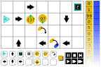
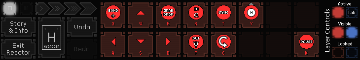
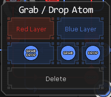

# The Programming Puzzler

In the “Programming Puzzler”, the player has to solve puzzles using a two-dimensional programming language.

## Genre

The game is a pure puzzle game. No action or reaction elements are planned. The player has an infinite amount of time and infinite resources to solve the puzzles. The two main incentives to play are the (relatively) high difficulty of the puzzles and the opportunity to optimize the solutions to compete with other players.

## General Description

The player is supposed to solve various puzzles, using an “agent” that moves on a two-dimensional grid. The agent has two (or three?) “stacks” that hold numbers. The starting point and direction is known (or can be chosen) and the path of the agent can be changed using arrows or conditional direction changes. Commands like “add 1” or “switch the first two elements in the stack” can be placed onto the grid. The agent will execute these commands when moving over them. The commands will not disappear.

## Name

“Programming Puzzler” is just a project name. The name will most likely be influenced by the theming. Naming suggestions are welcome!

## Gameplay Mechanics

	TODO: Keywords to consider: Goals, User skills, Game mechanics, Items and power ups, Progression and challenge, Losing, Evaluation/High Scores, UI, Controls, Achievements

### Levels

The large grid shows the level with finished solution. The task (that was given before) is to discard all zeros and move all other numbers from the orange to the blue stack. The player has already placed commands onto the grid using drag and drop from the command keys in the bottom to the grid or by keeping the associated key on the keyboard while clicking on the grid (desktop only). The orange rectangle covering the blue rectangle can be used to change the default stack from orange to blue. Any element on the grid can be moved by drag and drop from one grid cell to another. A “rubber band” can be dragged across the grid to select and move multiple commands at once. Any element can be changed by clicking (tapping) on it. An element-specific menu will pop up next to (or around) the element. In the pop up menu, the orientation of arrows, the colours of stack-related commands, and the orientation of the “if” commands can be changed.

The two bars on the right side show the contents of the orange and blue stacks. The orange stack is set at the beginning of the level with the numbers `[0, 1, 99, 0, 5, 0, 0, -3, 0, 42]`. The white on black buttons on the lower right allow the player to start, step, fast forward (various speeds), pause, and stop the simulation.

When starting the simulation, the agent will be placed at the turquoise triangle facing to the east (right). It will step forward, onto the arrow. Since the arrow already points to the east, the agent will continue straight ahead. The next command will check if the orange stack (orange background; a blue background would check for the blue stack) is empty. If the stack were empty, the agent would follow the little green arrow with the “+” inside towards north (up). Since the stack is not empty, the agent will continue unaffected towards east, reaching the next command. This command checks if the first element of the orange stack is a zero. Since this is the case, the agent will turn south (down) and move to the next command. This command unconditionally pops an element from the stack and discards it. The agent will then continue its way along the arrows. This time, the first element is a one, so the agent will not turn south on the check, but continue east until it reaches the south arrow. Using this way, it will come to the command popping an element from the orange stack and pushing it to the blue stack. This will continue until the orange stack is empty. The agent will then turn north and east, reaching the “end”. The blue stack will then contain `[42, -3, 5, 99, 1]`. The level is finished successfully. A few more test cases should be checked for in highest speed to confirm that the setup works with any input (including empty stacks, only zeros, no zeros at all, …).

Possible symbols that were not used in the level are the “debug” symbol (placed on hotkey R) and the “addition” symbol (place on hotkey G). The debug symbol will pause the simulation when reached. In larger levels, the player can place it anywhere in the level to be able to fast forward through the first part of a lengthy algorithm, without missing a possibly buggy part of the algorithm. The addition symbol will pop two elements from the (in this case orange) stack, add them together and push them back to the same stack.

A very cool feature would be to allow the user to use solved levels as symbols. For example, multiplication can be build out of addition symbols. The whole level could later be used as multiplication symbol. Even cooler would be the possibility to include the *current* level as a symbol. This way, functional programming would be possible. If is unclear to me at the moment, if the animation should show the jumps into the other symbols, but probably not. The only exception could be a debug symbol. When reached in a called self-made command, the view could jump into that command.

### Level Progression

The player can choose from a number of levels that are unlocked after earlier levels are solved. The levels should be organized in a tree where every branch stands for a problem family. The player can e.g. unlock the first and second level of the “sorting” branch, but fail to solve the second sorting level. They can then try the first level of the “stacking” branch and later come back to the sorting branch.

## Theme

The theme is not clear, yet. I see four possible themes, but I’m open to newer suggestions. The themes are listed here in order of my current preference, where the wizard and scientist are pretty close to each other.

1. **Wizard**. A wizard (or witch or magus or …) could be the agent and protagonist. The protagonist could wander in fantasy worlds, roaming through dungeons, wizard towers, witch swamps, villages, castles, etc. The wizard’s actions could be interpreted as the abstract thinking done while conjuring a spell. It would allow for a male or female character to choose.

2. **Scientist**. A (crazy?) scientist, as the wizard, could be the agent and protagonist. It would also allow to play a male or female character. The scientist would roam through his/her lab, a university, a research institute, even a dungeon, etc. The scientists actions could be interpreted as the abstract thinking in his/her brain to solve a problem in the lab/uni/etc.

3. **Robot**. This is probably the most obvious theme for this type of game, since the player has, in a way, to program the agent. A robot could also be a protagonist. However, since it is so obvious and already used in other similar games, I would like to avoid this. A possibility for a robot would be to make the levels very un-mechanic.

4. **Abstract**. The agent could be some geometric shape or abstract object (like in *Jahooma’s LogicBox* or *Manufactoria*). As this was already done in at least two other games of the genre, I would like to avoid this, too.

## Story

Although it is not necessary for this type of game, I would like to add some kind of story to it. The story might be told in between the levels in cutscenes or text snippets.

The story will heavily depend on the theming.

## Menu Flow

Upon starting the game, a loading screen will show with the name of the game. After loading, the main menu is shown. Here, they player can create a profile, open the options screen, or show the credits (unless the credits are so short they can be shown in the main menu). After a profile is created (name, sex, other individualizations), a new game can be started. If the game is restarted, the last profile will be loaded with the option to change the profile or to create a new profile.

When starting a new game, a short intro (animation, text, …) is shown and the level select screen is shown. Here, the player can choose to play the tutorial levels or to jump right to the “real” levels. When starting a level, the goal will be displayed, together with some optional story elements. Some tutorial bubbles can be shown to explain new elements. The player thinks about a solution and constructs it using the available tiles. The player starts the simulation. When the goal is achieved, statistics are shown (how many tiles where used, how many steps did the agent move). The player has the choice to change the solution to achieve better statistics or to go to the level select screen. Here, optional story elements may be shown and new levels can be chosen.

## Visuals/Style

I think, the most clear presentation would be in a simple rectangular 2D grid. An isometric view would be cool, but probably a bit more difficult to interpret as a player and also more complicated to create assets for this type of view. The 2D grid could be made with an actual 3D view that would allow for easy zoom and rotation. However, these functions are not necessary and the arts would be more complicated.

Some kind of retro Zelda style would be cool, but a view straight from above might be easier to read for the player. Some testing is need to find out the best presentation.

## Assets

### Graphics

- Buttons and background (and fluff) for the start menu and options menu
- Borders, buttons, background, grid for the levels
- Symbols for all commands
- Agent sprite(s)
- Whatever is needed for the story

### Sounds

Sounds should be unobtrusive. Maybe some *chuck* when a tile is placed. When the player wins a level, a kind of fanfare (depending on the theme) might be played. It must be possible to switch off sounds!

### Music

If there is any music at all, it should be unobtrusive background music. Ambient sound might be an alternative. It must be very easy to switch off the music!

	TODO: Check, what music similar games have (menu, level select, levels)

## Influences

### Befunge

Befunge is an “esoteric” programming language from 1993 that is the main inspiration for Programming Puzzler. The language uses plain text files where each position is a cell in a grid. The pointer starts in the upper left corner, pointing to the right. The program has one stack to use. Each character in the plain text file is a command. There are commands to write a number or ASCII character to the grid. This can either be used as additional save slots or to change the program while running.

An extension, Befungell, can be used to run multi-threaded processes and could be a cool inspiration for a similar system in Programming Puzzler.

[Esolangs Wiki entry](https://esolangs.org/wiki/Befunge)

[Befungell Github page](https://github.com/zwade/Befungell)

### Robot Unlock

Robot Unlock is probably the game that is closest to Programming Puzzler. The player has to solve mostly mathematical problems using an agent in the shape of a robot and a grid. The robot has four memory slots that each hold a number. The tasks are usually to set the four memory slots to given numbers or following a pattern. The robot also has two pointers (light green and dark green) that each point to one of the memory slots. Commands can be placed on the grid and can be either in light or dark green, determining the memory slot, the operation is executed on. The pointers can also be moved using commands on the grid.

Programming Puzzler will use memory stacks instead of memory slots and it will not have moving pointers. Robot Unlock suffers from inelegant controls. Also, the in-game explanations are scarce and all commands are available from the first level. Programming Puzzler will have a little bit more story, the commands will be unlocked gradually with sufficient explanation and the theming will be different.

[Review and download](https://jayisgames.com/review/robot-unlock.php) (free, Windows desktop only)

### Human Resource Machine

In this game, the player has to program a human to perform a task. Input are blocks of numbers or letters that must be taken one after the other. Blocks can be placed on the (gridded) floor. The block in the human’s hand can be compared or added (or, or …) to the block on the floor. After processing (find the smallest number, add two numbers, only output even numbers), the solutions block or blocks must be placed on the output slot.

In principle, the game has an input and output stack, some “storage space” on the floor and one “active” element in the hand. The major difference to Programming Puzzler is that the human is programmed directly and uses the floor tiles to store values.

[Producer website](https://tomorrowcorporation.com/humanresourcemachine) (approx. 15 US$, desktops and tablets)

### Jahooma's LogicBox

In this game, the player also has to place commands on a grid. Abstract objects move along the commands. Each object has a queue that can be manipulated. This game features the possibility to use previous levels as command blocks in the following levels.

[The game on Kongregate](https://www.kongregate.com/games/jahooma/jahoomas-logicbox) (free, Flash player)

### Spacechem

Spacechem is a game by Zachtronics Industries. The main inspiration from this game is the way, elements are placed on the grid and how one can change placed elements by clicking on them. A pop-up opens for the player to change aspects of the elements.

[Producer website](http://www.zachtronics.com/spacechem) (approx. 10 US$, desktops and Android)

## Targeted platforms

For simplicity, I would go for Desktops and maybe Browsers. These are still used a lot and it is easy to release software on these platforms (at least Linux, Browser, and Windows, in this order). Mouse and keyboard together with large screens make the GUI development relatively easy.

Mobile platforms are more complicated to release to, the screens are smaller (maybe except tablets), and the controls are more delicate. Mobile platforms are used a lot these days. The gameplay will force players to think a lot and interact less with the screen, so it would be possible for the player to open a level and read the problem within very short time. Building and testing the solution is not time critical and can be paused instantly and indefinitely. Hence, the game would work well on mobile platforms, I think.

At the moment, I would focus on Desktops and Browsers but try to keep a possible distribution on mobile platforms in the head when it comes to the GUI and controls.

## Localization

All texts should be implemented such that internationalization (and localization) is relatively easy. Graphics and symbols should, as far as possible, be universal. It might be wise to allow for graphics to be changed depending on the localization. I guess, European languages should be prioritized (simpler for me …).

## Monetization

Currently, I plan the game to be free and open source.

---

This work is licensed under a [Creative Commons Attribution 4.0 International
License][cc-by].

[![CC BY 4.0][cc-by-image]][cc-by]

[cc-by]: http://creativecommons.org/licenses/by/4.0/
[cc-by-image]: https://i.creativecommons.org/l/by/4.0/88x31.png
